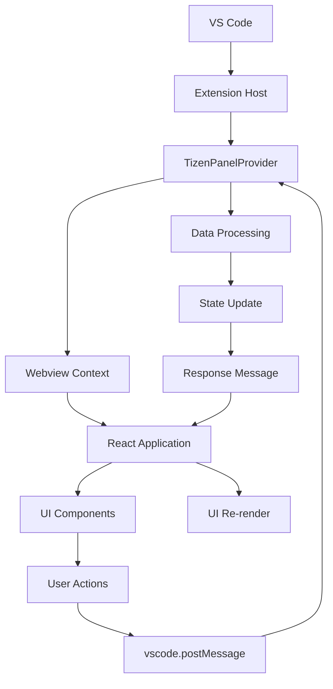

# Tizen VS Code Extension - Complete Documentation

## 📋 Table of Contents

1. [Overview](#overview)
2. [Learning Path: A to Z VS Code Extension Development](#learning-path)
3. [Project Architecture](#project-architecture)
4. [Detailed Component Breakdown](#detailed-component-breakdown)
5. [Workflow & Data Flow](#workflow--data-flow)
6. [Setup & Development](#setup--development)
7. [Building & Testing](#building--testing)
8. [Publishing](#publishing)
9. [Troubleshooting](#troubleshooting)
10. [Advanced Topics](#advanced-topics)

---

## 🎯 Overview

The **Tizen VS Code Extension** is a custom panel that integrates into VS Code's bottom panel area, providing full CRUD (Create, Read, Update, Delete) operations for managing entries with Name, Email, and Description fields.

### Key Features

- ✅ Custom panel in VS Code's bottom area (next to Problems, Output, Debug Console)
- ✅ Full CRUD operations with a clean React-based interface
- ✅ Responsive design with VS Code theme integration
- ✅ Real-time data synchronization between extension and UI
- ✅ Form validation and error handling

---

## 📚 Learning Path: A to Z VS Code Extension Development

### 🎓 Essential Technologies & Skills

#### **1. Core Programming Languages**

| Technology     | Priority     | Purpose                                 | Learning Resources                                                                    |
| -------------- | ------------ | --------------------------------------- | ------------------------------------------------------------------------------------- |
| **TypeScript** | 🔴 Critical  | Primary language for VS Code extensions | [TypeScript Handbook](https://www.typescriptlang.org/docs/)                           |
| **JavaScript** | 🔴 Critical  | Foundation for TypeScript and web APIs  | [MDN JavaScript Guide](https://developer.mozilla.org/en-US/docs/Web/JavaScript/Guide) |
| **HTML/CSS**   | 🟡 Important | Webview interfaces and styling          | [MDN Web Docs](https://developer.mozilla.org/en-US/docs/Web/HTML)                     |
| **Node.js**    | 🟡 Important | Runtime environment for extensions      | [Node.js Documentation](https://nodejs.org/en/docs/)                                  |

#### **2. Frontend Technologies**

| Technology   | Priority     | Purpose               | When to Use                         |
| ------------ | ------------ | --------------------- | ----------------------------------- |
| **React**    | 🟡 Important | Complex UI components | Interactive panels, forms           |
| **CSS/SCSS** | 🟡 Important | Styling and theming   | Custom designs, VS Code integration |
| **Webpack**  | 🟠 Moderate  | Module bundling       | Building and optimizing code        |

#### **3. VS Code Specific APIs**

| API Category          | Key Concepts                                            | Usage Examples      |
| --------------------- | ------------------------------------------------------- | ------------------- |
| **Extension API**     | `vscode.ExtensionContext`, `activate()`, `deactivate()` | Extension lifecycle |
| **Webview API**       | `WebviewViewProvider`, `Webview`, message passing       | Custom UI panels    |
| **Commands API**      | `registerCommand()`, command contributions              | Custom commands     |
| **Configuration API** | Settings, workspace config                              | Extension settings  |

#### **4. Development Tools**

```bash
# Package Management
npm install / yarn install

# Version Control
git init, add, commit, push

# Debugging
VS Code Extension Host, Debug Console

# Testing
npm test, VS Code Test Runner
```

---

## 🏗️ Project Architecture

### 📁 Project Structure

```
tizen/
├── 📂 .vscode/                    # VS Code workspace configuration
│   ├── launch.json               # Debug launch configurations
│   └── tasks.json                # Build and development tasks
├── 📂 media/                      # Static assets and styles
│   ├── reset.css                 # CSS reset for consistent styling
│   ├── vscode.css               # VS Code theme integration
│   └── styles.css               # Custom component styles
├── 📂 resources/                  # Extension resources
│   └── tizen.svg                # Custom panel icon
├── 📂 src/                       # Source code directory
│   ├── 📂 test/                 # Test files
│   │   └── extension.test.ts    # Extension unit tests
│   ├── 📂 webview/              # React frontend code
│   │   ├── 📂 components/       # Reusable React components
│   │   │   ├── CreateForm.tsx   # New entry creation form
│   │   │   ├── DetailsView.tsx  # Entry details display
│   │   │   ├── EditForm.tsx     # Entry editing form
│   │   │   └── TableView.tsx    # Main data table with actions
│   │   ├── App.tsx              # Main React application
│   │   ├── index.tsx            # React DOM entry point
│   │   └── types.ts             # TypeScript type definitions
│   ├── extension.ts             # Main extension entry point
│   └── tizenPanelProvider.ts    # Webview provider and data management
├── 📂 out/                       # Compiled JavaScript output
│   ├── extension.js             # Compiled extension code
│   └── webview.js              # Compiled React application
├── package.json                  # Extension manifest and dependencies
├── tsconfig.json                # TypeScript compiler configuration
├── webpack.config.js            # Build system configuration
└── README.md                    # Project documentation
```

### 🔧 Architecture Layers

#### **Layer 1: VS Code Integration**

```typescript
// Extension Host (Node.js Context)
extension.ts → Handles VS Code lifecycle
├── activate() - Extension startup
├── deactivate() - Extension cleanup
└── registerWebviewViewProvider() - Panel registration
```

#### **Layer 2: Data Management**

```typescript
// Data Layer
tizenPanelProvider.ts → Manages webview and data
├── resolveWebviewView() - Creates webview instance
├── _getHtmlForWebview() - Generates HTML content
├── onDidReceiveMessage() - Handles React messages
└── _entries[] - In-memory data storage
```

#### **Layer 3: User Interface**

```typescript
// React Application (Webview Context)
src/webview/ → React-based user interface
├── App.tsx - Main application logic
├── Components/ - Modular UI components
└── types.ts - Type definitions
```

---

## 🔍 Detailed Component Breakdown

### 📦 Core Components

#### **1. Extension Entry Point (`extension.ts`)**

```typescript
export function activate(context: vscode.ExtensionContext) {
  // Purpose: Initialize extension and register providers
  // Key responsibilities:
  // - Create TizenPanelProvider instance
  // - Register webview view provider with VS Code
  // - Register commands and event handlers
  // - Set up extension lifecycle
}

export function deactivate() {
  // Purpose: Clean up resources when extension is disabled
}
```

**Key Concepts:**

- **Extension Context**: Container for extension resources and subscriptions
- **Provider Registration**: Makes the panel available in VS Code UI
- **Command Registration**: Enables custom commands in command palette

#### **2. Webview Provider (`tizenPanelProvider.ts`)**

```typescript
export class TizenPanelProvider implements vscode.WebviewViewProvider {
  private _entries: Entry[] = []; // Data storage

  public resolveWebviewView(webviewView: vscode.WebviewView) {
    // Purpose: Initialize webview when panel is first shown
    // Key responsibilities:
    // - Set webview options (security, resources)
    // - Generate HTML content with React app
    // - Set up message handling between extension and React
    // - Initialize data and send to React app
  }

  private _getHtmlForWebview(webview: vscode.Webview) {
    // Purpose: Generate HTML template for React app
    // Includes: CSS links, security policies, React script
  }
}
```

**Key Concepts:**

- **WebviewViewProvider Interface**: Contract for creating custom panels
- **Message Passing**: Communication bridge between extension and React
- **Security**: Content Security Policy and resource restrictions
- **HTML Generation**: Dynamic HTML with proper VS Code integration

#### **3. React Application (`src/webview/App.tsx`)**

```typescript
const AppContent: React.FC = () => {
  const [entries, setEntries] = useState<Entry[]>([]);
  const [currentView, setCurrentView] = useState<ViewType>("table");
  const [selectedEntry, setSelectedEntry] = useState<Entry | null>(null);

  // Purpose: Main application state and routing logic

  useEffect(() => {
    // Initialize VS Code API communication
    vscode.postMessage({ type: "getData" });

    // Set up message listener for extension responses
    window.addEventListener("message", messageHandler);
  }, []);
};
```

**Key Concepts:**

- **State Management**: React hooks for UI state
- **Message Handling**: Communication with extension
- **View Routing**: Navigation between different screens
- **Error Boundaries**: Graceful error handling

#### **4. UI Components**

##### **TableView Component**

```typescript
interface TableViewProps {
  entries: Entry[];
  onView: (entry: Entry) => void;
  onEdit: (entry: Entry) => void;
  onDelete: (id: string) => void;
  onCreate: () => void;
}

// Purpose: Display data in tabular format with action buttons
// Features: Responsive design, action icons, empty state handling
```

##### **CreateForm Component**

```typescript
interface CreateFormProps {
  onSave: (data: { name: string; email: string; description: string }) => void;
  onCancel: () => void;
}

// Purpose: Form for creating new entries
// Features: Form validation, controlled inputs, error handling
```

##### **EditForm Component**

```typescript
interface EditFormProps {
  entry: Entry;
  onSave: (data: Partial<Entry>) => void;
  onCancel: () => void;
}

// Purpose: Form for editing existing entries
// Features: Pre-populated fields, validation, update logic
```

##### **DetailsView Component**

```typescript
interface DetailsViewProps {
  entry: Entry;
  onBack: () => void;
}

// Purpose: Display full entry details including description
// Features: Read-only view, navigation, formatted display
```

---

## 🔄 Workflow & Data Flow

### 📊 Communication Architecture



### 🔄 Detailed Message Flow

#### **1. Extension Initialization**

```
1. VS Code starts → activate() called
2. TizenPanelProvider created and registered
3. User clicks Tizen tab
4. resolveWebviewView() triggered
5. HTML with React app generated
6. React app loads and requests initial data
```

#### **2. CRUD Operations Flow**

##### **Create Entry:**

```
User fills form → onSave() → vscode.postMessage({
  type: "createEntry",
  data: { name, email, description }
}) → Extension receives message → Creates new entry with ID →
Adds to _entries array → webview.postMessage({
  type: "entryCreated",
  data: newEntry
}) → React receives message → Updates state → UI re-renders →
Returns to table view
```

##### **Read/View Entry:**

```
User clicks View icon → onView() → setSelectedEntry() →
setCurrentView("details") → DetailsView component renders →
Shows all entry information including description
```

##### **Update Entry:**

```
User clicks Edit icon → EditForm loads with existing data →
User modifies and submits → onSave() → vscode.postMessage({
  type: "updateEntry",
  data: updatedEntry
}) → Extension finds entry by ID → Updates in _entries →
Response sent back → React updates state → Returns to table
```

##### **Delete Entry:**

```
User clicks Delete icon → onDelete() → vscode.postMessage({
  type: "deleteEntry",
  id: entryId
}) → Extension filters out entry → webview.postMessage({
  type: "entryDeleted",
  id: entryId
}) → React filters state → UI updates
```

### 🔧 Build Process Flow

```
Development:
TypeScript Source Files → webpack-dev → Compiled JS → Extension Host

Production:
TypeScript Source → Webpack Build → Minified JS → Package → .vsix file
```

---

## 🚀 Setup & Development

### 📋 Prerequisites

```bash
# Required software
Node.js (v16 or later)
npm or yarn
VS Code (latest version)
Git
```

### 🛠️ Development Setup

#### **1. Initial Setup**

```bash
# Clone the repository
git clone <repository-url>
cd tizen

# Install dependencies
npm install

# Open in VS Code
code .
```

#### **2. Development Commands**

```bash
# Compile once
npm run compile

# Watch mode (auto-recompile on changes)
npm run watch

# Run tests
npm test

# Lint code
npm run lint
```

#### **3. Debugging**

```bash
# Launch Extension Development Host
Press F5 in VS Code

# Or use Command Palette
Ctrl+Shift+P → "Debug: Start Debugging"
```

### 🔧 Configuration Files

#### **launch.json** - Debug Configuration

```json
{
  "version": "0.2.0",
  "configurations": [
    {
      "name": "Run Extension",
      "type": "extensionHost",
      "request": "launch",
      "args": ["--extensionDevelopmentPath=${workspaceFolder}"],
      "outFiles": ["${workspaceFolder}/out/**/*.js"],
      "preLaunchTask": "npm: compile"
    }
  ]
}
```

#### **tasks.json** - Build Tasks

```json
{
  "version": "2.0.0",
  "tasks": [
    {
      "label": "npm: compile",
      "type": "npm",
      "script": "compile",
      "group": "build"
    }
  ]
}
```

#### **webpack.config.js** - Build Configuration

```javascript
// Dual configuration for extension and webview
module.exports = [extensionConfig, webviewConfig];
```

---

## 🏗️ Building & Testing

### 📦 Build Process

#### **Development Build**

```bash
npm run compile
# Generates: out/extension.js, out/webview.js
# Includes: Source maps for debugging
```

#### **Production Build**

```bash
npm run vscode:prepublish
# Generates: Minified, optimized code
# Removes: Debug information, console logs
```

### 🧪 Testing Strategy

#### **1. Unit Tests**

```typescript
// src/test/extension.test.ts
import * as assert from "assert";
import * as vscode from "vscode";

suite("Extension Test Suite", () => {
  test("Extension should be present", () => {
    assert.ok(vscode.extensions.getExtension("your-extension-id"));
  });
});
```

#### **2. Integration Tests**

```bash
# Run all tests
npm test

# Run specific test file
npm test -- --grep "Extension Test Suite"
```

#### **3. Manual Testing Checklist**

- [ ] Extension activates without errors
- [ ] Tizen panel appears in bottom panel area
- [ ] Create functionality works
- [ ] Edit functionality works
- [ ] Delete functionality works
- [ ] View details functionality works
- [ ] Navigation between views works
- [ ] Form validation works
- [ ] Error handling works

---

## 📢 Publishing

### 📋 Pre-Publishing Checklist

- [ ] Update version in package.json
- [ ] Update CHANGELOG.md
- [ ] Run all tests
- [ ] Build production version
- [ ] Test in clean VS Code installation

### 🚀 Publishing Steps

#### **1. Install vsce (VS Code Extension CLI)**

```bash
npm install -g vsce
```

#### **2. Package Extension**

```bash
vsce package
# Generates: tizen-0.0.1.vsix
```

#### **3. Publish to Marketplace**

```bash
# Login to marketplace
vsce login <publisher-name>

# Publish extension
vsce publish
```

#### **4. Local Installation**

```bash
# Install from .vsix file
code --install-extension tizen-0.0.1.vsix
```

---

## 🔧 Troubleshooting

### ❗ Common Issues

#### **1. Extension Not Loading**

```
Symptoms: Extension doesn't appear in extensions list
Solutions:
- Check package.json syntax
- Verify activation events
- Check console for errors
- Restart VS Code
```

#### **2. Webview Not Showing**

```
Symptoms: Tizen panel is empty or shows loading message
Solutions:
- Check HTML generation in tizenPanelProvider.ts
- Verify webpack build completed
- Check Content Security Policy
- Examine Debug Console for errors
```

#### **3. React App Not Loading**

```
Symptoms: Loading message persists, no React content
Solutions:
- Verify webview.js was built correctly
- Check VS Code API initialization
- Ensure React scripts are included
- Check for JavaScript errors
```

#### **4. Message Passing Issues**

```
Symptoms: CRUD operations don't work
Solutions:
- Check vscode.postMessage() calls
- Verify message handlers in extension
- Ensure VS Code API is available
- Check message format consistency
```

### 🔍 Debug Techniques

#### **1. Extension Host Debugging**

```bash
# Debug Console (Ctrl+Shift+Y)
- Shows extension errors
- Console.log output from extension
- VS Code API call results
```

#### **2. Webview Debugging**

```bash
# Developer Tools for Webview
- Right-click in webview → Inspect Element
- Console tab shows React errors
- Network tab shows resource loading
```

#### **3. Logging Strategy**

```typescript
// Extension side
console.log("Extension received message:", message);

// React side
console.log("React state updated:", entries);
```

---

## 🎓 Advanced Topics

### 🔐 Security Considerations

#### **Content Security Policy**

```html
<meta
  http-equiv="Content-Security-Policy"
  content="default-src 'none'; 
               style-src ${webview.cspSource} 'unsafe-inline'; 
               script-src 'nonce-${nonce}';"
/>
```

#### **Resource Access**

```typescript
webview.options = {
  enableScripts: true,
  localResourceRoots: [this._extensionUri],
};
```

### 📊 Performance Optimization

#### **1. Lazy Loading**

```typescript
// Load components only when needed
const DetailsView = React.lazy(() => import("./DetailsView"));
```

#### **2. Memoization**

```typescript
// Prevent unnecessary re-renders
const MemoizedTableView = React.memo(TableView);
```

#### **3. Bundle Optimization**

```javascript
// webpack.config.js
optimization: {
  minimize: true,
  splitChunks: {
    chunks: 'all'
  }
}
```

### 🔄 State Persistence

#### **1. Extension Context Storage**

```typescript
// Save state
context.globalState.update("tizenEntries", this._entries);

// Load state
const savedEntries = context.globalState.get("tizenEntries", []);
```

#### **2. Workspace Storage**

```typescript
// Workspace-specific data
context.workspaceState.update("tizenData", data);
```

### 🎨 Theming & Styling

#### **1. VS Code Theme Integration**

```css
/* Use VS Code CSS variables */
.my-component {
  background: var(--vscode-editor-background);
  color: var(--vscode-editor-foreground);
  border: 1px solid var(--vscode-panel-border);
}
```

#### **2. Dark/Light Theme Support**

```css
/* Automatic theme adaptation */
.button {
  background: var(--vscode-button-background);
  color: var(--vscode-button-foreground);
}

.button:hover {
  background: var(--vscode-button-hoverBackground);
}
```

---

## 📚 Additional Resources

### 📖 Documentation

- [VS Code Extension API](https://code.visualstudio.com/api)
- [Webview API Guide](https://code.visualstudio.com/api/extension-guides/webview)
- [React Documentation](https://reactjs.org/docs/)
- [TypeScript Handbook](https://www.typescriptlang.org/docs/)

### 🛠️ Tools & Libraries

- [VS Code Extension Generator](https://github.com/Microsoft/vscode-generator-code)
- [vsce CLI](https://github.com/microsoft/vscode-vsce)
- [Extension Test Runner](https://github.com/microsoft/vscode-test)

### 💡 Best Practices

- Follow VS Code extension guidelines
- Use semantic versioning
- Write comprehensive tests
- Provide clear documentation
- Handle errors gracefully
- Optimize for performance
- Support accessibility

---

## 🎯 Conclusion

This Tizen VS Code Extension demonstrates a complete implementation of a custom panel with full CRUD functionality. The architecture separates concerns between the extension host (Node.js) and the webview (React), providing a maintainable and scalable foundation for VS Code extension development.

Key takeaways:

- **Clean Architecture**: Separation between data management and UI
- **Modern Stack**: TypeScript, React, and Webpack
- **VS Code Integration**: Proper use of extension APIs
- **User Experience**: Intuitive interface matching VS Code design
- **Development Workflow**: Comprehensive build and debug setup

This project serves as an excellent learning resource and starting point for building sophisticated VS Code extensions with custom user interfaces.

---

_Last updated: September 21, 2025_
